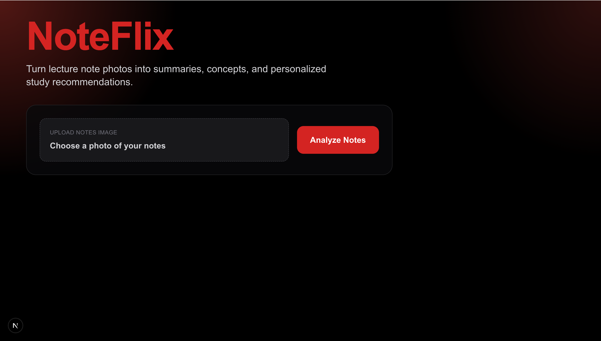
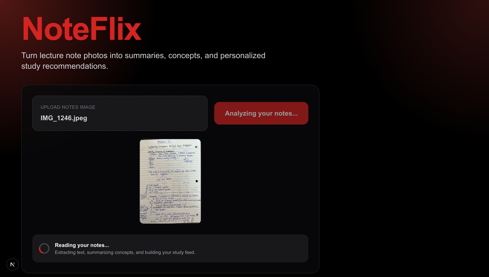
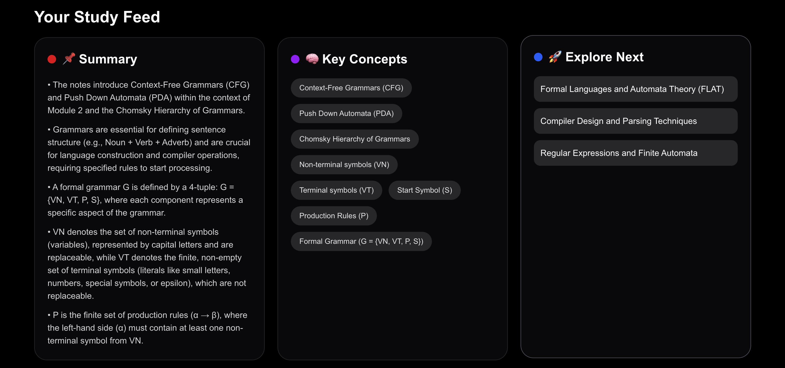
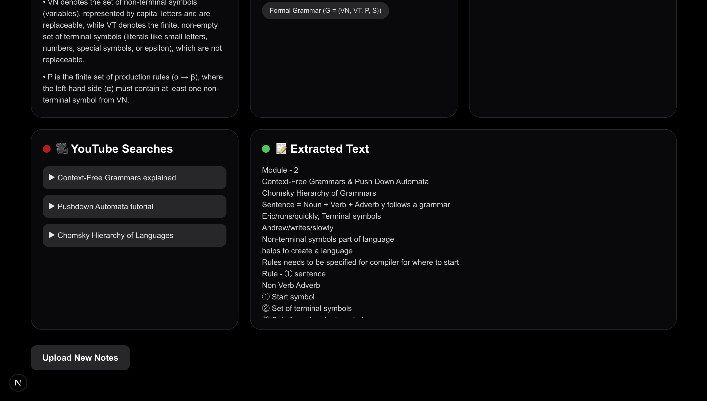

# NoteFlix

NoteFlix is an AI-powered full-stack web app that transforms lecture notes into structured summaries, key concepts, and personalized study recommendations using the Google Gemini API.

---
## 📸 Demo
End-to-end flow: upload → AI processing → structured study feed

### Home / Upload


### Loading State


### Results / Study Feed



---

## 🚀 Features

- Upload an image of handwritten or printed notes
- Extracts text from images using AI
- Generates:
  - Summary (bullet points)
  - Key Concepts
  - Related Topics to explore
  - YouTube learning suggestions
- Clean, modern study dashboard UI
- Real-time analysis with loading states

---

## 🛠 Tech Stack

### Frontend
- Next.js (App Router)
- TypeScript
- Tailwind CSS

### Backend
- FastAPI (Python REST API)
- Google Gemini API (Multimodal LLM)

---

## ⚙️ How It Works

1. User uploads an image of notes
2. Frontend sends image to FastAPI backend
3. Backend sends image + structured prompt to Gemini
4. Gemini returns structured study content (JSON)
5. Frontend displays it in a clean study dashboard

---

## 🧪 Running Locally

### 1. Clone the repo

```bash
git clone https://github.com/aanilgeo/noteflix.git
cd noteflix
```

---

### 2. Backend Setup
```bash
cd backend
python -m venv venv
source venv/bin/activate
pip install -r requirements.txt
```

Create a `.env` file:
```
GEMINI_API_KEY=your_api_key_here
```

Run backend:
```bash
uvicorn main:app --reload
```
---

### 3. Frontend Setup
```bash
cd ../frontend
npm install
npm run dev
```

---

## 📌 Future Improvements
- User authentication
- Save past study sessions
- Export summaries as PDF
- Deploy to cloud (Vercel + Render)